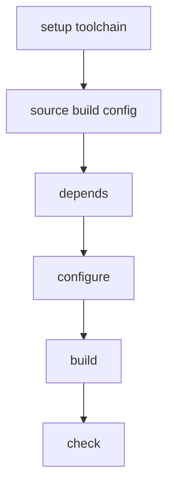

# Package Build Scripts

My package build scripts

Features:

- Build with NDK
- Statically linked binaries oriented.

## Work flow



## Usage

### Run in command line

```sh
## ABI defined in build-package.sh is aarch64-linux-android
## API defind in build-pacakge.sh is 24 (package build.sh can override this)
./build-package.sh <package_name1> <packge_name2> ...

## Build for x86_64
ABI=x86_64-linux-android ./build-package.sh <package_name1> <packge_name2> ...

### List of Android ABIs
## aarch64-linux-android
## armv7a-linux-androideabi
## x86_64-linux-android
## i686-linux-android
```

### Run in vscode

Presss <kbd>Ctrl</kbd>+<kbd>Shift</kbd>+<kbd>B</kbd> and then input package name in terminal panel.

## Add a new package

### File structrue

```txt
. <============================== WORK_DIR
├── build
│   └── make-4.4.1 <============= PKG_BASENAME
│       └── ...
├── build-all.sh
├── build-package.sh
├── output <===================== OUTPUT_DIR
│   └── aarch64-linux-android <== ABI
│       ├── bin
│       ├── include
│       └── share
├── packages
│   └── make <=================== PKG_CONFIG_DIR
│       └── build.sh <=========== <package build config>
├── README.md
└── sources <==================== SRCS_DIR
    └── make-4.4.1.tar.gz <====== PKG_BASENAME + PKG_EXTNAME
```

### Enviroment defined in build-package.sh

| Env            | Defination                              |
| -------------- | --------------------------------------- |
| WORK_DIR       | This repo root                          |
| SRCS_DIR       | Where we place source code package      |
| PKG_CONFIG_DIR | Where we place build script and patches |
| ABI            | Android ABI                             |
| API            | Android API level                       |
| TARGET         | Toolchain target tripple                |
| OUTPUT_DIR     | Install prefix                          |
| JOBS           | Parallel process used to build          |

### Enviroment required in build.sh

| Env          | Defination                             |
| ------------ | -------------------------------------- |
| PKG_BASENAME | The name where we cd in build dir      |
| PKG_EXTNAME  | kind of source pacakge, i.e, '.tar.gz' |
| PKG_SRCURL   | URL to get source package              |

### Functions defined in build.sh

```sh
## Defines dependencies of this package
## function prepare_depends will be called along with this function
depends(){
    # echo <lib_xxx>
    # echo <lib_yyy>
}
```

```sh
## Parepare source and cd to source dir
## Overide this function to prepare source by your self
prepare_source(){
    # cd "${SRCS_DIR}"
    # git clone <URL> <pacakge_name>
    # cd <package_name>
}
```

```sh
## Step to configure
configure(){
    ## Custom API
    # export API=28
    # setup_ndk_toolchain

    ## Autoconf
    # ./configure --host="${TARGET}" --prefix="${OUTPUT_DIR}"
}
```

```sh
## Step to build
build(){
    # make -j"${JOBS}" install

    ## Build a go package
    # setup_golang
    # go build -ldflags="-w -s -X main.Version=${PKG_VERSION}"
}
```

```sh
## Step to check
## If current package is a dependency to the other package declaimed by function 'depends',
## during building of the other package,
## functions prepare_depends will be called and then call this function to check if it is built.
check(){
    # test -f "${OUTPUT_DIR}/lib/<lib_xxx>.a"
}
```

We do not need to write all of the these functions above, for example: when building a go pacakge, writing the build function is just enough.
