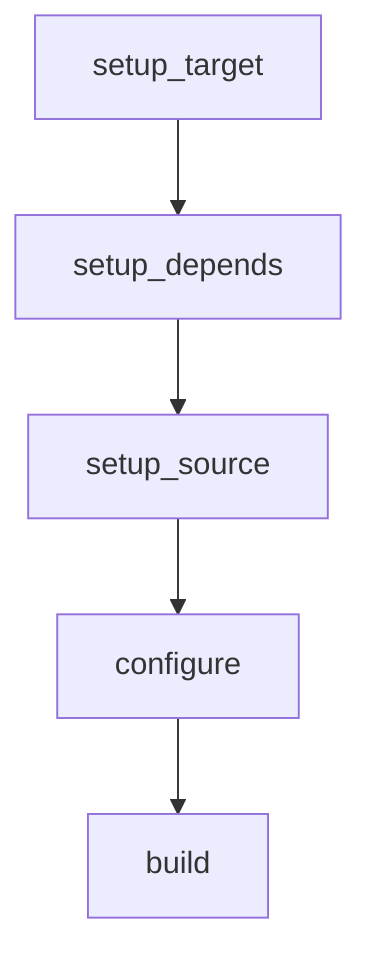

# Package Build Scripts

My package build scripts

Features:

- Build with NDK
- Statically linked binaries oriented.

## Usage

### Run in command line

```sh
## Build for host machine
./build-packages.sh <packag1> <package2> ...

## Build for android
## Android ABIs:
##      aarch64-linux-android
##      armv7a-linux-androideabi
##      x86_64-linux-android
##      i686-linux-android
TARGET=aarch64-linux-android28 ./build-package.sh <package1> <packge2> ...

## Build for aarch64-linux-musl
TARGET=aarch64-linux-android28 ./build-package.sh <package1> <packge2> ...

```

## Work flow


